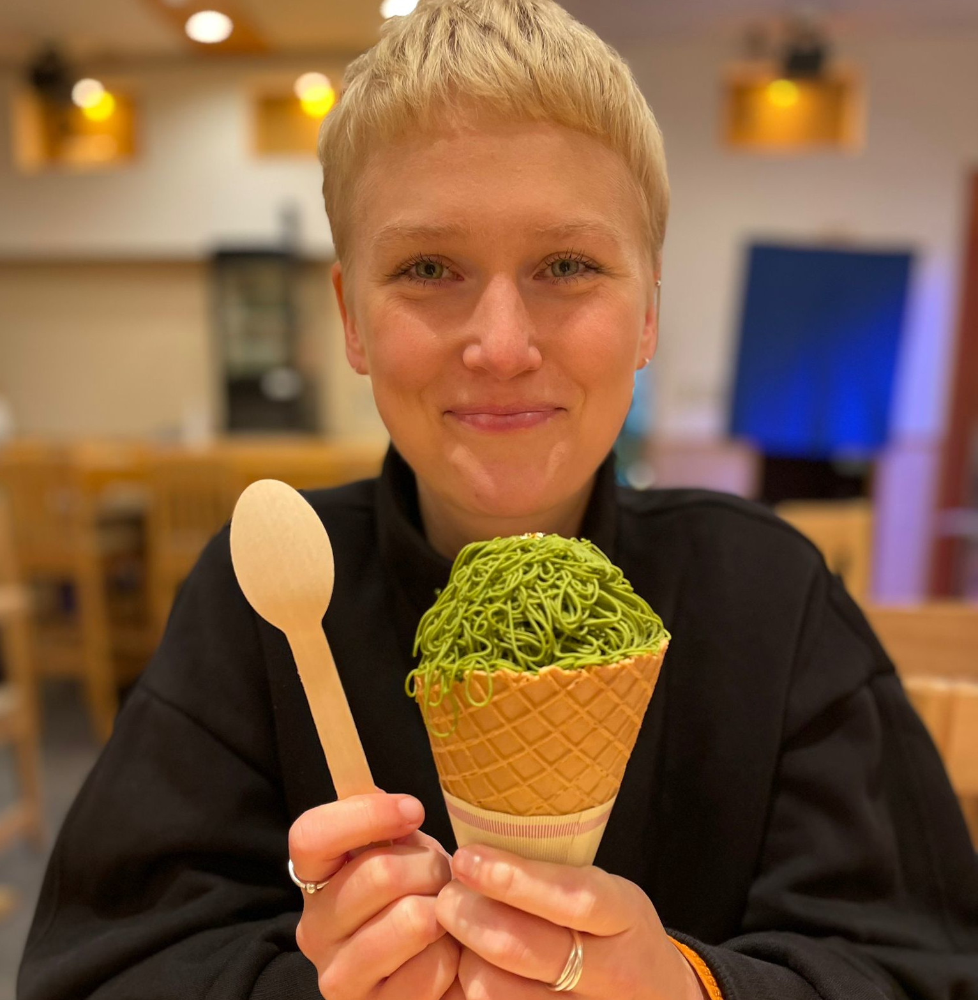

  

Welcome to my personal website! I'm a PhD student at the [Department of Computer Science and Technology, University of Cambridge](https://www.cst.cam.ac.uk/people/irs38).

- 🔗 [Google Scholar](https://scholar.google.com/citations?user=6RuW6IoAAAAJ&hl=en&inst=6810896796868835251)
- 📄 [CV](IevaStaliunaiteCV2025.pdf)
- 📧 [email](mailto:irs38@cam.ac.uk)

---

## About Me

I am a researcher working on Natural Language Processing. My work focuses on fact-checking, ambiguity and uncertainty.

---

## Contact

Feel free to reach out if you're interested in collaboration, have questions about my work, or just want to chat!

📍 London, United Kingdom  
✉️ [email](mailto:irs38@cam.ac.uk)  
💼 [LinkedIn](https://www.linkedin.com/in/ieva-raminta-stali%C5%ABnait%C4%97-972a9658/)
